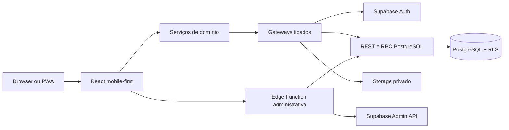
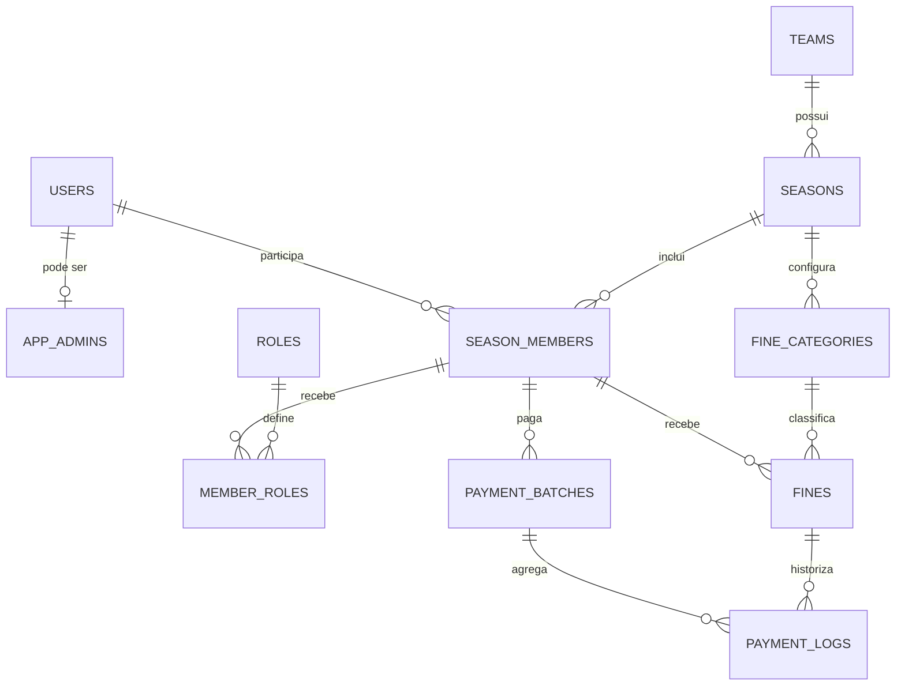

# Caixinha das Multas — guia técnico e preparação para entrevista

## 1. Como usar este documento

Este guia serve para:

- explicar o projeto de forma estruturada numa entrevista;
- rever as decisões técnicas e os respetivos compromissos;
- preparar uma demonstração curta, sem expor credenciais ou dados pessoais;
- responder a perguntas a partir do raciocínio de engenharia, em vez de decorar frases.

O objetivo não é afirmar que todas as decisões são universais. Uma boa entrevista
técnica avalia sobretudo se consegues explicar o contexto, as alternativas, os
riscos e o motivo pelo qual uma solução foi adequada neste produto.

## 2. Resumo para currículo

### Descrição curta

Aplicação web mobile-first e PWA para gestão contabilística de multas internas de
equipas de futebol, com autenticação por username, controlo de acesso por função,
operações financeiras transacionais e isolamento por equipa e época.

### Exemplos de pontos para o currículo

- Desenvolvi uma PWA mobile-first em React e TypeScript, publicada em Cloudflare
  Pages, com backend Supabase/PostgreSQL e suporte futuro para empacotamento com
  Capacitor.
- Modelei autorização multi-equipa com Row Level Security, funções PostgreSQL,
  RBAC acumulável e operações financeiras atómicas e idempotentes.
- Implementei uma estratégia de testes que cobre componentes, serviços, regras de
  domínio, migrações, RLS, concorrência, autenticação real e fluxos E2E desktop e
  mobile.

### Apresentação de 30 segundos

> A Caixinha das Multas é uma PWA para equipas de futebol registarem multas e
> controlarem o que está pendente ou liquidado. Construí o frontend em React e
> TypeScript e usei Supabase/PostgreSQL no backend. A parte mais importante não é
> o formulário em si: é garantir isolamento entre equipas, autorização real no
> servidor e consistência financeira perante repetições, concorrência ou
> correções. Por isso, as escritas passam por RPCs transacionais, os valores são
> guardados em cêntimos e o histórico financeiro é imutável.

## 3. Problema resolvido

Antes da aplicação, este tipo de caixa costuma depender de folhas, mensagens e
memória informal. Isso cria problemas de rastreabilidade:

- não é claro quem deve o quê;
- uma alteração de preço pode reescrever implicitamente o passado;
- pagamentos podem ser marcados duas vezes;
- jogadores não têm uma visão pessoal consistente;
- a informação coletiva pode expor detalhe que devia permanecer privado.

A aplicação funciona como livro-razão. Os pagamentos reais continuam a acontecer
fora do sistema. Não processa dinheiro, MB Way, transferências ou cartões.

O produto regista:

- catálogo de infrações por época;
- multas aplicadas e o valor calculado no momento;
- estado pendente ou pago;
- correções de liquidação;
- totais contabilísticos;
- histórico pessoal e rankings agregados.

Esta delimitação é uma decisão de produto e de risco: evita transformar uma
ferramenta interna num sistema de pagamentos regulado e mais complexo.

## 4. Utilizadores e permissões

O modelo separa tipo de membro, funções de equipa e permissão global.

| Conceito       | Significado              | Capacidades principais                                              |
| -------------- | ------------------------ | ------------------------------------------------------------------- |
| Jogador        | Tipo base de membro      | Consulta o próprio painel e os rankings                             |
| Equipa técnica | Tipo base de membro      | Mesma experiência de consulta; multiplicador 2x                     |
| Capitão        | Função acumulável        | Badge coletivo e multiplicador 2x                                   |
| Tesoureiro     | Função acumulável        | Catálogo, aplicação, liquidação, reabertura e eliminação autorizada |
| Owner          | Permissão global privada | Utilizadores, equipas, épocas, plantéis, fotografias e auditoria    |

Um tesoureiro pode ser jogador, elemento da equipa técnica e/ou capitão. O Owner
não aparece como tal no plantel e não ganha automaticamente poderes financeiros.
Se o Owner precisar de gerir a caixa de uma época, tem também de ser tesoureiro
dessa época.

Esta composição evita uma hierarquia rígida de papéis e representa melhor a
realidade do clube.

## 5. Stack tecnológica

| Camada              | Tecnologia                                          | Motivo principal                                                |
| ------------------- | --------------------------------------------------- | --------------------------------------------------------------- |
| Linguagem           | TypeScript                                          | Contratos explícitos entre UI, serviços e dados                 |
| Frontend            | React                                               | Componentização, ecossistema e evolução para Capacitor          |
| Build               | Vite                                                | Desenvolvimento rápido e bundles web eficientes                 |
| Estilos             | Tailwind CSS + tokens semânticos                    | UI mobile-first consistente sem acoplar domínio ao tema         |
| Routing             | React Router                                        | Rotas protegidas e carregamento lazy por área funcional         |
| Estado remoto       | TanStack Query                                      | Cache em memória, invalidação e estados de pedidos              |
| Formulários         | React Hook Form + Zod                               | Formulários eficientes e validação explícita nas fronteiras     |
| Backend             | Supabase                                            | Auth, PostgreSQL, Storage e Edge Functions no mesmo ecossistema |
| Base de dados       | PostgreSQL                                          | Constraints, transações, RLS e funções de domínio               |
| Ficheiros           | Supabase Storage                                    | Fotografias privadas com políticas próprias                     |
| Funções server-side | Supabase Edge Functions                             | Operações da Admin API que exigem credenciais secretas          |
| Alojamento          | Cloudflare Pages                                    | HTTPS, integração Git e hosting estático gratuito               |
| Testes              | Vitest, Testing Library, PGlite, pgTAP e Playwright | Cobertura desde regras puras até browser e backend reais        |
| Mobile futuro       | Capacitor                                           | Reutilização da aplicação web em Android/iOS                    |

### Porque React/Vite e não React Native/Expo?

O primeiro objetivo era funcionar por URL em telemóveis e ser desenvolvido em
Windows. O produto é constituído sobretudo por formulários, listas, dashboards e
operações de dados, áreas em que a web oferece excelente suporte.

React com Vite permitiu:

- testar imediatamente no browser;
- publicar como PWA sem pipeline de lojas;
- usar uma base de código simples e gratuita;
- preparar Capacitor sem antecipar complexidade nativa.

Expo seria uma escolha válida se a prioridade inicial fossem APIs nativas,
distribuição imediata nas lojas ou uma experiência que dependesse fortemente de
componentes móveis específicos.

## 6. Visão de arquitetura



O frontend não fala diretamente com detalhes de infraestrutura a partir dos
componentes. A direção pretendida é:

```text
apresentação -> serviço de domínio -> contrato/gateway -> Supabase
```

Os componentes tratam interação e apresentação. Os serviços validam precondições
e regras que melhoram a experiência. Os gateways convertem contratos TypeScript
em chamadas Supabase. A base de dados volta a validar autorização e invariantes.

## 7. Organização modular

```text
src/
  app/             composição, providers, routing e páginas agregadoras
  domains/
    admin/         contas, equipas, épocas, plantéis e fotografias
    auth/          login, sessão, autorização e mudança de password
    dashboard/     saldo e histórico pessoal
    fines/         catálogo, aplicação e comissão mensal
    leaderboard/   rankings coletivos
    treasury/      liquidação, reabertura, eliminação e totais
  shared/          componentes, configuração, formulários e utilitários
  styles/          tokens e regras visuais transversais
supabase/
  migrations/      schema, constraints, RLS, RPCs e reporting
  functions/       operações administrativas server-side
  tests/           pgTAP
tests/             testes de base de dados, scripts e output Pages
e2e/               percursos completos em Chromium
```

### Fronteiras importantes

- `shared` não depende de `app` nem dos domínios.
- Um domínio não importa outro domínio arbitrariamente.
- `app` é a composition root e liga providers, rotas e serviços.
- As integrações externas estão atrás de gateways.
- Regras financeiras não vivem nos componentes React.

Esta estrutura é suficiente para o tamanho atual. Microserviços acrescentariam
deploys, observabilidade e consistência distribuída sem resolver um problema real
do produto.

## 8. Frontend

### Rotas e carregamento

As rotas funcionais são carregadas com `React.lazy`. Cada área tem um provider
próprio e só carrega os serviços necessários quando é visitada. As rotas estão
protegidas por três níveis:

1. sessão autenticada;
2. mudança obrigatória da password temporária;
3. capacidade `member`, `treasurer` ou `admin`.

Esconder uma rota ou botão melhora a experiência, mas não é a barreira de
segurança. A autorização definitiva acontece novamente no backend.

### Estado remoto

TanStack Query gere pedidos, cache e invalidação. A configuração usa:

- `staleTime` curto para leituras;
- uma repetição para queries;
- zero repetições automáticas para mutations;
- sem refetch automático ao focar a janela.

Não repetir mutations automaticamente reduz o risco de duplicar uma ação. Mesmo
assim, a consistência não depende desta opção: as operações críticas continuam a
usar chaves de idempotência no servidor.

### Formulários e validação

React Hook Form reduz renders e organiza estados de formulário. Zod valida dados
recebidos e respostas externas. A validação cliente dá feedback rápido, mas não é
considerada uma fronteira de confiança.

### Interface mobile-first

- navegação inferior com no máximo quatro destinos e folha `Mais`;
- áreas táteis entre 44 e 48 px;
- `safe-area-inset` para ecrãs com notch;
- campos com 16 px em mobile para impedir zoom automático no iPhone;
- diálogos montados em portal e centrados no viewport;
- cartões e rankings testados a 320, 390 e 430 px;
- barra lateral em desktop sem criar uma segunda aplicação.

### Tema

O tema `Balneário Premium` usa tokens semânticos para superfície, texto, marca,
bordas, foco, sombras e raios. As páginas não conhecem cores concretas do tema.
Uma futura família visual pode implementar o mesmo contrato sem duplicar regras
de domínio.

## 9. PWA e comportamento offline

A aplicação é online-first.

O service worker guarda apenas:

- shell da aplicação;
- página de indisponibilidade;
- manifest, ícones e assets estáticos da mesma origem.

Nunca guarda persistentemente pedidos de Auth, REST, RPC ou Storage. Operações
administrativas e financeiras falham antes de contactar o gateway quando o
browser está offline.

Esta opção é deliberada. Enfileirar pagamentos offline exigiria resolver ordem,
duplicação, conflitos, revogação de permissões e reconciliação. Para um livro-
razão pequeno, é mais seguro exigir rede durante as escritas.

Uma nova versão do service worker espera pela confirmação do utilizador, ativa a
versão seguinte e recarrega depois da mudança de controlador. Isso evita trocar
JavaScript enquanto a pessoa está no meio de uma operação.

## 10. Autenticação por username

Supabase Auth autentica por email/password, mas o produto não apresenta emails.
A solução usa um adaptador determinístico:

1. normaliza o username;
2. codifica-o em Base32;
3. cria um email técnico num domínio reservado;
4. autentica esse identificador com Supabase Auth;
5. carrega o contexto autorizado através de uma RPC protegida.

O mesmo username produz sempre o mesmo identificador técnico sem guardar uma
tabela pública de emails. O frontend nunca mostra esse email.

### Proteções adicionais

- não existe auto-registo;
- mensagens de login são genéricas para reduzir enumeração de contas;
- contas inativas não obtêm contexto válido;
- passwords nunca entram nas tabelas públicas;
- a primeira sessão pode ficar limitada à mudança obrigatória de password;
- criação e reposição de contas passam pela Edge Function protegida.

## 11. Autorização e multi-tenancy

O isolamento combina RBAC e contexto relacional:

- `app_admins` representa a permissão global privada;
- `season_members` associa utilizador, equipa e época;
- `member_roles` atribui `captain` e/ou `treasurer` nessa associação;
- RLS filtra leituras e escritas segundo `auth.uid()`;
- RPCs críticas verificam novamente ator, época, estado e relações.

O tenant funcional é a equipa/época. Guardar `season_id` explicitamente nas
tabelas financeiras torna o isolamento e as consultas mais claros, mesmo quando
o valor também poderia ser inferido por joins.

### Porque RLS é essencial

A chave publicável do Supabase está no browser por desenho. Não é um segredo. A
segurança depende de políticas RLS, grants restritos e funções server-side.

Sem RLS, ocultar o botão no React não impediria uma pessoa de chamar diretamente
a API. Com RLS, a própria base rejeita a operação fora do contexto autorizado.

## 12. Modelo de dados

O núcleo tem 14 tabelas públicas:

- identidade aplicacional: `users`, `app_admins`;
- organização: `teams`, `seasons`;
- plantel e funções: `season_members`, `roles`, `member_roles`;
- catálogo e multas: `fine_categories`, `fines`;
- livro-razão: `payment_batches`, `payment_logs`;
- auditoria e coordenação administrativa: `audit_events`,
  `admin_user_requests`, `admin_password_reset_requests`.



### Dinheiro em cêntimos

Todos os valores são inteiros. `5,00 EUR` é armazenado como `500`.

Isso evita imprecisão binária de `float`, simplifica constraints e torna somas e
comparações determinísticas. A conversão para euros acontece apenas na
apresentação.

### Snapshots

Uma multa guarda o nome e os valores da categoria no momento da aplicação. Se a
categoria mudar no futuro, o passado não muda.

Isto é importante porque `fine_categories` representa configuração atual,
enquanto `fines` representa um facto histórico.

## 13. Regras financeiras críticas

### Cálculo

```text
valor final = (valor base + valor por minuto × minutos) × multiplicador
```

- jogador normal: 1x;
- equipa técnica: 2x;
- capitão: 2x;
- capitão que também pertence à equipa técnica: continua 2x;
- tesoureiro: não altera o multiplicador.

O multiplicador é fixado quando a multa é aplicada. Alterações futuras no
plantel não reescrevem multas antigas.

### Estados

```text
aplicação  -> pending
liquidação -> paid
reabertura -> pending, mantendo has_ever_been_paid = true
eliminação -> apenas pending e nunca paga
```

### Liquidação

O tesoureiro seleciona multas completas. Não introduz um valor recebido e não
existem pagamentos parciais. O servidor calcula o total, cria um batch e um log
imutável por multa.

### Reabertura

Uma correção não apaga o pagamento anterior. Cria um novo evento `reopened` e
atualiza o estado atual. Assim, o sistema distingue estado corrente de histórico.

### Eliminação

Só uma multa pendente que nunca foi paga pode ser eliminada. Uma multa reaberta
continua protegida porque `has_ever_been_paid` não volta a `false`.

### Comissão mensal

Depois de fechar um mês, o tesoureiro pode gerar uma comissão fixa para membros
sem multas normais nesse período. A operação:

- usa valor fixo e multiplicador 1;
- é protegida e transacional;
- é idempotente por membro, época e mês;
- nunca cria duas comissões para o mesmo contexto.

## 14. Transações, idempotência e concorrência

Operações críticas são funções PostgreSQL transacionais:

- criação e cópia de época;
- aplicação de multa;
- geração de comissões;
- liquidação ou reabertura em lote;
- eliminação protegida;
- alterações administrativas relacionadas.

Cada comando recebe uma chave de idempotência. Repetir o mesmo pedido deve
devolver o mesmo resultado ou ser rejeitado de forma segura, nunca duplicar
efeitos.

Na liquidação, o servidor bloqueia e valida as multas dentro da mesma transação.
Os testes de concorrência usam duas sessões independentes: uma operação vence e
a outra é recusada, mantendo um único batch e um único conjunto de logs.

Este é um bom exemplo para explicar que desativar um botão evita duplos toques na
UI, mas não resolve concorrência. A garantia real pertence ao servidor.

## 15. Edge Function administrativa

A função `admin-users` existe porque algumas operações exigem a Admin API do
Supabase:

- criar identidade Auth;
- ativar ou desativar acesso;
- repor password temporária;
- coordenar Auth com perfil público e auditoria.

Proteções relevantes:

- JWT obrigatório;
- origem CORS exata;
- confirmação server-side de Owner ativo;
- credenciais secretas disponíveis apenas no runtime;
- segredo HMAC próprio para pedidos de reposição;
- contratos idempotentes na base de dados;
- nenhuma password escrita em logs ou tabelas públicas.

## 16. Storage e fotografias

As fotografias ficam num bucket privado.

- apenas o Owner pode escrever ou remover;
- a leitura exige utilizador autenticado autorizado;
- a imagem é redimensionada e comprimida antes do upload;
- o caminho é guardado no perfil, não o conteúdo binário;
- o frontend usa URLs assinadas de curta duração quando necessário.

Esta opção protege dados pessoais e evita depender de transformações pagas do
fornecedor.

## 17. Segurança por camadas

### No browser

- validação de configuração pública;
- rotas e ações filtradas por capacidade;
- validação Zod;
- mensagens de autenticação genéricas;
- escritas recusadas offline;
- sem chaves secretas em variáveis `VITE_`.

### Na rede e hosting

- HTTPS;
- Content Security Policy limitada às origens necessárias;
- proteção contra embedding com `frame-ancestors 'none'`;
- assets versionados com cache imutável;
- HTML e service worker sem cache prolongado;
- assets inexistentes devolvem 404 em vez do documento SPA.

### No backend

- RLS nas tabelas;
- grants mínimos;
- funções com `search_path` restrito;
- Admin API apenas na Edge Function;
- constraints estruturais e financeiras;
- auditoria imutável para operações relevantes.

Segurança não é uma única funcionalidade. É a combinação de fronteiras que
continuam válidas mesmo que alguém ignore completamente a interface.

## 18. Estratégia de testes

### Regras e serviços

Vitest cobre regras puras, serviços, autorização, formatação, configuração e
comportamentos offline. Testing Library testa a aplicação pelo que a pessoa vê e
faz, evitando acoplamento excessivo à implementação interna.

### PostgreSQL reproduzível

PGlite cria bases isoladas, aplica todas as migrações e testa:

- constraints;
- RLS/RBAC;
- multiplicadores e snapshots;
- estados financeiros;
- idempotência;
- imutabilidade do ledger;
- concorrência intercalada;
- manifesto de produção.

### Backend real descartável

pgTAP e scripts de integração validam Auth, Storage, Edge Function e concorrência
contra um projeto separado de testes. Fixtures usam prefixos próprios, limpeza em
`finally` e auditoria de zero resíduos.

### End-to-end

Playwright percorre autenticação, membro, tesouraria e administração em Chromium
desktop e móvel. A matriz móvel verifica 320, 390 e 430 px sem overflow.

### Gates atuais registadas

- 126 testes web;
- 13 cenários PostgreSQL reproduzíveis;
- 5 testes do output Cloudflare Pages;
- 10 percursos E2E desktop/mobile;
- suites remotas de RLS, Auth, Admin, Storage e concorrência documentadas no
  diário da Fase 08.

Os números ajudam a demonstrar alcance, mas numa entrevista é mais importante
explicar quais os riscos cobertos e porque foram escolhidos.

## 19. Deploy e operação

### Frontend

O Cloudflare Pages acompanha `main` e executa a verificação antes de publicar o
diretório `dist`. O build de produção falha se as quatro variáveis públicas
obrigatórias não estiverem presentes.

O processo gera regras de cache apenas para assets que realmente existem. Isto
evita que um caminho JavaScript inexistente receba o HTML da SPA com cache de um
ano.

### Backend

O schema evolui apenas por migrações versionadas. Produção e testes usam projetos
separados e os scripts sensíveis exigem referência explícita para reduzir o risco
de operar no alvo errado.

### Custo

O MVP usa níveis gratuitos do Supabase e Cloudflare. Isso é adequado a um piloto
pequeno, mas implica compromissos:

- sem SLA contratual;
- possibilidade de pausa por inatividade;
- limites de utilização;
- backups manuais no plano atual.

## 20. Decisões e compromissos que deves conseguir defender

| Decisão                 | Benefício                                    | Compromisso                                                |
| ----------------------- | -------------------------------------------- | ---------------------------------------------------------- |
| Monólito modular        | Simplicidade operacional e transações locais | Escala-se o conjunto, não módulos independentes            |
| Supabase                | Backend completo com baixo custo inicial     | Maior dependência do fornecedor e Postgres/RLS             |
| PWA online-first        | Entrega rápida e código único                | Escritas dependem de rede; sem presença imediata nas lojas |
| Dinheiro em cêntimos    | Cálculos determinísticos                     | Formatação/conversão explícita nas fronteiras              |
| Snapshots nas multas    | Histórico estável                            | Duplicação intencional de alguns campos                    |
| RLS + RPCs              | Segurança junto dos dados                    | Mais complexidade SQL e necessidade de testes por papel    |
| Logs imutáveis          | Auditoria e correções rastreáveis            | Mais tabelas e consultas históricas                        |
| Idempotência            | Segurança perante repetição                  | Gestão de chaves e contratos adicionais                    |
| Sem pagamentos parciais | Modelo simples e coerente com o clube        | Menor flexibilidade para outros contextos                  |

## 21. Limitações atuais e evolução

Convém apresentar limitações com honestidade e um plano proporcional:

- backups e restauro ainda precisam de procedimento operacional final testado;
- a política mínima de password pode ser reforçada e alinhada entre frontend e
  Auth;
- o nível gratuito não oferece garantias de disponibilidade;
- não existe observabilidade centralizada avançada;
- não existem notificações push;
- Android/iOS nativos ainda não foram empacotados;
- escritas offline não fazem parte do modelo;
- o pipeline remoto depende da disponibilidade/configuração da conta GitHub.

Próximos passos razoáveis:

1. fechar backup, restauro, privacidade e resposta a incidente;
2. adicionar métricas e alertas operacionais mínimos;
3. medir bundle, queries e índices com utilização real;
4. rever política de passwords e recuperação;
5. só depois avaliar Capacitor e publicação nas lojas.

## 22. Demonstração recomendada em entrevista

### Preparação

- usar a aplicação publicada, não um servidor local improvisado;
- não partilhar passwords nem abrir ficheiros de ambiente;
- não mostrar dados pessoais sem autorização;
- ter o diagrama e este documento abertos;
- preparar um percurso de cinco a oito minutos.

### Percurso

1. Explicar o problema e deixar claro que é um livro-razão.
2. Entrar com uma conta própria sem revelar a password.
3. Mostrar o painel pessoal e o Mural, destacando privacidade.
4. Mostrar como o tesoureiro aplica uma multa e como o total é calculado.
5. Explicar liquidação, reabertura e proteção contra eliminação.
6. Mostrar a Administração e a separação entre Owner e tesoureiro.
7. Abrir uma migração/RPC e explicar RLS, transação e idempotência.
8. Mostrar um teste de concorrência ou E2E e terminar com os compromissos.

Não é necessário demonstrar todas as páginas. Escolhe um fluxo que conte uma
história técnica coerente.

## 23. Perguntas frequentes de entrevista

### 23.1 “Porque escolheste esta stack?”

**O que estão a avaliar:** se a stack nasceu do problema ou de preferência
pessoal.

**Como raciocinar:** começa pelos requisitos: web mobile-first, Windows, custo
baixo, formulários, autenticação, PostgreSQL e evolução futura para mobile.
Depois liga cada tecnologia a um requisito e reconhece o compromisso.

**Formulação possível:** React/Vite acelerou a entrega web e mantém uma via para
Capacitor. Supabase forneceu Auth, PostgreSQL, Storage e funções sem exigir uma
equipa de infraestrutura. O compromisso é dependência do fornecedor, reduzida
por serviços e gateways próprios e por regras centrais em PostgreSQL.

### 23.2 “Porque não fizeste logo uma aplicação nativa?”

**O que estão a avaliar:** capacidade de priorizar.

**Como raciocinar:** o risco inicial era validar utilização e regras, não acesso a
sensores ou APIs nativas. Uma PWA reduz tempo e custo. Capacitor fica para quando
existir evidência de necessidade das lojas.

### 23.3 “A chave Supabase no frontend não é insegura?”

**O que estão a avaliar:** compreensão do modelo de segurança do Supabase.

**Como raciocinar:** distingue chave publicável de credencial secreta. A chave
pública identifica o projeto; RLS decide o acesso. Chaves secretas ficam apenas
no runtime server-side.

**Ponto essencial:** se a segurança dependesse de esconder a chave pública, o
desenho estaria errado.

### 23.4 “Porque precisas de RLS se já proteges as rotas?”

**O que estão a avaliar:** fronteiras de confiança.

**Como raciocinar:** a pessoa controla o browser e pode chamar a API sem usar a
UI. Rotas são experiência; RLS é autorização junto dos dados. RPCs críticas
fazem ainda validações específicas da operação.

### 23.5 “Como implementaste login por username num serviço que usa email?”

**O que estão a avaliar:** adaptação de uma limitação externa.

**Como raciocinar:** explica a transformação determinística username → email
técnico, a normalização, o domínio reservado e o facto de o email não ser
apresentado. Refere mensagens genéricas para evitar enumeração.

### 23.6 “Como evitas que um pagamento seja registado duas vezes?”

**O que estão a avaliar:** diferença entre prevenção na UI e consistência real.

**Como raciocinar:** menciona quatro camadas: botão ocupado, mutation sem retry,
chave de idempotência e transação PostgreSQL que bloqueia/valida as multas. A
última camada é a garantia decisiva.

### 23.7 “Porque guardas dinheiro em cêntimos?”

**O que estão a avaliar:** fundamentos de modelação financeira.

**Como raciocinar:** floats binários não representam todos os decimais com
exatidão. Inteiros tornam constraints, somas e igualdade determinísticas. Para
este domínio, duas casas decimais são suficientes.

### 23.8 “Porque duplicas nome e preço da categoria na multa?”

**O que estão a avaliar:** compreensão de dados históricos.

**Como raciocinar:** não é duplicação acidental; é um snapshot. O catálogo é
configuração mutável, a multa é um facto ocorrido. Sem snapshot, alterar o
catálogo reescreveria o passado.

### 23.9 “Porque tens batches e logs se a multa já tem estado?”

**O que estão a avaliar:** modelação de estado versus eventos.

**Como raciocinar:** `fines.status` responde rapidamente ao estado atual. Batches
e logs explicam como se chegou lá, permitem reabrir sem apagar história e
preservam o total calculado no momento.

### 23.10 “Como funciona o isolamento entre equipas?”

**O que estão a avaliar:** desenho multi-tenant.

**Como raciocinar:** a autorização passa pela associação do utilizador a uma
época. `season_id` acompanha os dados financeiros, RLS restringe por membership e
as RPCs verificam a época do ator, membro e recurso.

### 23.11 “Porque não usaste Redux?”

**O que estão a avaliar:** escolha proporcional de estado.

**Como raciocinar:** a maior parte do estado é remoto e encaixa em TanStack
Query. Sessão e injeção de serviços usam contexts pequenos. Redux acrescentaria
cerimónia sem resolver um problema presente. Se aparecesse estado cliente global
complexo, a decisão seria revista.

### 23.12 “Porque não permites escritas offline?”

**O que estão a avaliar:** gestão de conflitos.

**Como raciocinar:** operações financeiras e permissões podem mudar enquanto o
dispositivo está offline. Uma fila exigiria reconciliação e resolução de
conflitos. O valor do offline não justificava esse risco no MVP.

### 23.13 “Como testaste a segurança?”

**O que estão a avaliar:** se segurança foi validada ou apenas declarada.

**Como raciocinar:** fala da matriz RLS positiva e negativa, papéis diferentes,
contas inativas, épocas arquivadas, Edge Function sem JWT/origem inválida,
pesquisa de segredos e E2E num ambiente descartável com limpeza auditada.

### 23.14 “Qual foi um problema difícil que resolveste?”

**O que estão a avaliar:** método de diagnóstico.

**Como raciocinar:** usa a estrutura situação → evidência → causa → correção →
regressão.

Exemplos reais do projeto:

- um diálogo criado dentro de conteúdo animado aparecia no fim do scroll mobile;
  foi movido para um portal no `body`, com bloqueio de scroll e teste;
- o fallback SPA devolvia HTML para um asset inexistente com cache imutável;
  foram criados rewrites explícitos, `404.html` e regras de cache geradas a partir
  do `dist` real;
- testes de concorrência provaram que duas liquidações simultâneas não criam dois
  batches.

### 23.15 “O que farias diferente com mais escala?”

**O que estão a avaliar:** evitar tanto ingenuidade como arquitetura prematura.

**Como raciocinar:** primeiro medir. Depois rever índices e queries, adicionar
observabilidade, backups automáticos, SLA, rate limiting dedicado e filas para
trabalho assíncrono real. Só separar serviços quando existirem limites de equipa,
deploy ou carga que o justifiquem.

### 23.16 “Porque não escolheste microserviços?”

**O que estão a avaliar:** maturidade arquitetural.

**Como raciocinar:** o domínio é pequeno, a equipa é pequena e as operações
beneficiam de transações numa única base. Um monólito modular dá fronteiras
claras sem introduzir consistência distribuída e vários pipelines.

### 23.17 “Como tratarias uma falha de produção?”

**O que estão a avaliar:** pensamento operacional.

**Como raciocinar:** separar frontend de schema. No frontend, impedir nova
promoção e corrigir forward ou regressar ao deployment anterior. Em dados,
inventariar, fazer backup, aplicar apenas migrações versionadas e evitar reset de
produção. Credenciais comprometidas devem ser rodadas e sessões revogadas.

### 23.18 “Quais são as maiores limitações atuais?”

**O que estão a avaliar:** honestidade técnica.

**Como raciocinar:** não digas apenas “nenhuma”. Refere backups manuais, ausência
de SLA no free tier, política de password ainda por fechar e falta de apps nas
lojas. Explica também porque essas limitações foram aceitáveis no piloto.

### 23.19 “Como garantiste acessibilidade e experiência móvel?”

**O que estão a avaliar:** qualidade para além da lógica.

**Como raciocinar:** menciona HTML semântico, labels, foco visível, `Escape` em
diálogos, áreas táteis, contraste, safe areas, prevenção de zoom e testes E2E em
vários viewports. Reconhece que uma auditoria especializada adicional seria
válida antes de escalar o público.

### 23.20 “Qual foi exatamente o teu contributo?”

**O que estão a avaliar:** autoria e profundidade.

**Como raciocinar:** descreve áreas concretas que consegues abrir e explicar:
modelo de dados, RLS, serviços, UI, testes, deploy e operação. Usa commits e PRs
como evidência. Evita dizer apenas “fiz tudo”; escolhe duas ou três decisões
difíceis e explica-as em profundidade.

## 24. Como responder sem parecer decorado

Para qualquer pergunta técnica, usa esta sequência:

1. **Contexto:** qual era o requisito ou risco?
2. **Decisão:** o que escolheste?
3. **Alternativas:** que outras opções consideraste?
4. **Compromisso:** o que perdeste ou adiou a decisão?
5. **Evidência:** como testaste ou mediste?
6. **Evolução:** quando mudarias de abordagem?

Exemplo:

> Precisávamos de evitar duplicação perante duplo toque e pedidos concorrentes.
> O botão fica indisponível durante a mutation, mas essa não é a garantia. Cada
> comando tem uma chave de idempotência e a RPC valida e altera as multas numa
> transação. Considerei deixar o frontend controlar o fluxo, mas isso falharia
> com duas sessões. Validei a solução com sessões PostgreSQL independentes. Se o
> sistema passasse a aceitar pagamentos externos, acrescentaria reconciliação e
> identificadores do fornecedor.

## 25. Checklist antes de partilhar o ecrã

- [ ] Fechar ficheiros `.env`, gestores de passwords e terminais autenticados.
- [ ] Confirmar que o Git está limpo.
- [ ] Não abrir a pasta local de fotografias ou credenciais operacionais.
- [ ] Não executar scripts de produção durante a entrevista.
- [ ] Usar apenas a conta própria e ocultar a introdução da password.
- [ ] Ter preparado um diagrama, uma RPC, um teste e um fluxo da aplicação.
- [ ] Distinguir claramente o que está concluído do que pertence ao roadmap.

## 26. Ficheiros úteis para a entrevista

- `README.md`: instalação, execução e estrutura;
- `docs/01-arquitetura.md`: decisões arquiteturais;
- `docs/02-modelo-de-dados.md`: entidades e invariantes;
- `docs/03-regras-de-negocio.md`: regras funcionais;
- `docs/rls-rbac.md`: matriz de autorização;
- `supabase/migrations/`: implementação PostgreSQL;
- `src/domains/`: fronteiras e serviços;
- `e2e/`: percursos completos;
- `docs/fases/`: evolução, decisões, incidentes e validações por fase.

O histórico do repositório é parte do portefólio: mostra planeamento incremental,
revisões, correções e capacidade de transformar falhas encontradas em testes de
regressão.
